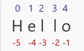
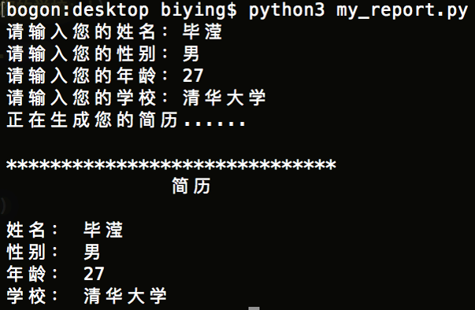

# Python编程零基础速成集训营

## 第一章 变量和数据类型
### 第一节丨变量
#### 变量命名规则
 - 大小写英文、数字、‘_’的结合
 - 不能以数字开头
 - 不能使用系统关键词（获取关键词列表的命令：`help('keywords')`）
 - 不能包含空格
 - 不能使用内置函数名称

#### 变量赋值规则
 - 同时给多个变量赋值同一内容：
 
```python
a=b=c=100
---
a=100
b=100
c=100
```

 - 同时给多个变量赋值不同的内容：
 
```python
a,b,c=1,2,3
---
a=1
b=2
c=3
```

### 第二节丨初识数据类型
`布尔型[bool]`,`数字型[int\float]`,`字符串[str]`,`元组[tuple]`,`字典 [dict]`,`集合[set]`,`列表[list]`

 - 查看变量类型的函数`type(XXX)`

#### 数字型 [int\float]
```python
a = 1
b = 2.0
```
#### 字符串 [str]
 - 创建方式为：单引号[']、双引号["]、三引号[''']
 - 字符串不可以使用索引下标进行字符内容修改
```python
a = 'Hello World'
b = "Hello World"
c = '''Hello World'''
```
#### 列表 [list]
```python
a = [1, 'two', 3.0, 'four']
```
#### 元组 [tuple]
元组创建完毕后无法修改
```python
a = (1, 'two', 3.0, 'four')
```
#### 字典 [dict]
字典无法索引查询（即无法用下标进行输出）
```python
a = {1：'one', 2:'two'}
```
#### 集合 [set]
集合会去掉重复的元素
```python
a = set([1, 2, 2, 3, 2, 6, 2, 1, 13, 5])
b = {1, 2, 2, 3, 2, 6, 2, 1, 13, 5}
```
#### 布尔型 [bool]
```python
a = True
b = False
```
布尔运算
```python
True and True
True and False
True or False
```

- - - - -

## 第二章 数据类型（上）
### 第一节丨数值
数值分为`整数[int]`及`浮点数[float]`，除法会产生浮点结果

#### 算术运算符
| 运算符 |             描述             |
| ----- | --------------------------- |
| +     | 加法运算符                   |
| -     | 减法运算符                   |
| \*    | 乘法运算符                   |
| /     | 除法运算符                   |
| **    | 指数运算符                   |
| %     | 取余运算符，计算余数          |
| //    | 出发取整运算符，只保留整数部分 |

#### 比较运算符
| 运算符 |          描述          |
| ----- | ---------------------- |
| >     | 判断左侧是否大于右侧     |
| <     | 判断左侧是否小于右侧     |
| >=    | 判断左侧是否大于等于右侧 |
| <=    | 判断右侧是否大于等于左侧 |
| ==    | 判断两侧是否相等        |
| !=    | 判断两侧是否不等        |

### 第二节丨字符串

#### 字符串索引组成  

 - 从>>左至右>>: 从0开始，最大范围是字符串长度减1
 - 从<<右至左<<：从-1开始，最大范围是字符串长度的负数

#### 字符串长度 [len]
```python
len(str)
```

#### 字符串中字符的获取 
> name[p:q:s]  p缺省为0, q缺省为len-1, s缺省为1

```python
a = '0123456789'
# name[p]       获取第p位内容
print(a[3])     # res: 3
# name[p:q]     获取p到q之间(不包括q位)的内容
print(a[3:6])   # res: 345
# name[p:q:s]   p到q之间(不包括q位),每s个字符提取一个
print(a[1:6:2]  # res: 135
print(a[6:1:-1] # res: 65432
# name[::-1]    倒序输出
print(a[::-1])  # res: 9876543210
```

#### 字符串内置方法
|         方法          |            描述             |
| --------------------- | --------------------------- |
| .lower()              | 字符串整体转换为小写字母      |
| .upper()              | 字符串整体转换为大写字母      |
| .find("x")            | 查找第一个x字符的下标        |
| .replace("old","new") | 替换"old"子串为"new"         |
| .count("x")           | 统计字符串中"x"字串出现的次数 |
| .isalpha()            | 字符串只包含字母则返回True    |
| .isdigit()            | 字符串只包含数字则返回True    |
```python
x = "HELLO WORLD"
print(x.lower()) # res: hello world
```

章节测试里的知识拓展
1. `v=name.strip()` 移除`指定字符串`，`空白`，`/t`，`/n`等转义字符  
2. `v1=name.startswith("al")` 判断以什么开头
3. `v2=name.endswith("X")` 判断以什么结尾
4. `print('|'.join(name))` 将 name 变量对应的值根据 “l” 分割
5. `v5=name.casefold()` Python3.3版本引入，lower() 方法只对ASCII编码，也就是‘A-Z’有效，对于其他语言（非汉语或英文）中把大写转换为小写的情况只能用 casefold() 方法。
6. `swapcase()` 大小写互相转换

#### 字符串转义
```python
s1 = 'hello\nworld'  # \n : 换行
s2 = 'I\'m a leaner' # \' : '字符本身
```
| 转义字符 |     含义     |
| ------- | ------------ |
| \\      | 反斜杠`\`本身 |
| \n      | 换行         |
| \t      | 制表符`tab`   |
| \000    | 空           |
> 当在字符串前加上小写字母`r`或大写字母`R`表示原始字符串，不对其中的任何字符进行转义。

#### 字符串连接
```python
x = '1'
y = '2'
print(x+y) # res: 12
```

#### 获取用户输入
```python
user_input = input()
print(user_input)

user_input = input('请输入>') # 带提示文字的输入
print(user_input)

```

#### 数据类型的强制转换
```python
# 强制转换成数字
# 可以将`浮点数1.4`转换为`整形1`, 舍去了小数部分
int(某个数字/字符串)

# 强制转换成字符串
# 可以将`字符串"12345"`转换为`数值12345`
str(某个数字/某种数据类型)`
``` 


### 作业一丨创建一个问答式简历软件
效果图  


代码  

```python
name = input("请输入你的姓名: ")
sex = input("请输入你的性别: ")
age = input("请输入你的年龄: ")
school = input("请输入你的学校: ")
print("正在生成您的简历......")
print("\n")
print("******************************")

print("\t\t简历\n")
print("姓名:\t"+name)
print("性别:\t"+sex)
print("年龄:\t"+age)
print("学校:\t"+school)
```

### 作业一讲解（2.15上线）

- - - - -

## 60min编程逻辑极速养成

- - - - -

## 第三章 数据类型（中）
### 第一节丨列表
### 第二节丨元组

- - - - -

## 第四章 数据类型（下）
### 第一节丨字典
### 第二节丨集合

- - - - -

## 11行代码教你写个小游戏

- - - - -

## 第五章 if条件判断
### 第一节丨布尔表达式
### 第二节丨if条件判断

- - - - -

## 第六章 while循环
### while循环

- - - - -

## 第七章 for循环
### for循环
### 作业二丨创建一个运势预测软件

- - - - -

### 复习及测试习题讲解

- - - - -

## 第八章 函数
### 第一节丨计算机函数的概念
### 第二节丨函数的定义与调用

- - - - -

## 第九章 类
### 第一节丨类的概念
### 第二节丨类的使用
### 第三节丨self参数的使用

- - - - -

## 项目作业丨对话式对战游戏设计