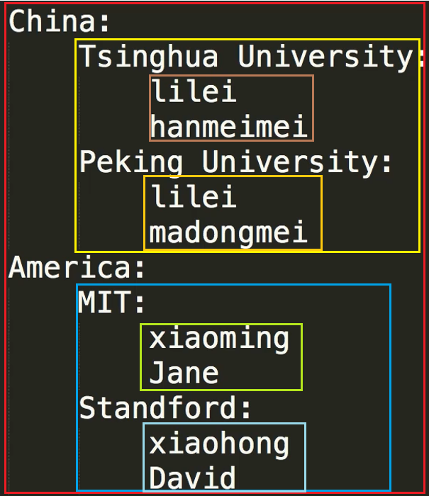

> 有道精品课 2019年2月14日
# Python编程零基础速成集训营
## 1. 第一章 变量和数据类型
### 1.1. 第一节丨变量
#### 1.1.1. 变量命名规则
 - `大小写英文`、`数字`、`_(下划线)`的结合
 - 不能以数字开头
 - 不能使用系统关键词（获取关键词列表的命令：`help('keywords')`）
 - 不能包含空格
 - 不能使用内置函数名称

#### 1.1.2. 变量赋值规则
 - 同时给多个变量赋值同一内容：
 
```python
a=b=c=100
####
a=100
b=100
c=100
```

 - 同时给多个变量赋值不同的内容：
 
```python
a,b,c=1,2,3
####
a=1
b=2
c=3
```

### 1.2. 第二节丨初识数据类型
`布尔型[bool]`,`数字型[int\float]`,`字符串[str]`,`元组[tuple]`,`字典 [dict]`,`集合[set]`,`列表[list]`

 - 查看变量类型的函数`type(XXX)`

#### 1.2.1. 数字型 [int\float]
```python
a = 1
b = 2.0
```
#### 1.2.2. 字符串 [str]
 - 创建方式为：单引号[']、双引号["]、三引号[''']
 - 字符串不可以使用索引下标进行字符内容修改
```python
a = 'Hello World'
b = "Hello World"
c = '''Hello World'''
```
#### 1.2.3. 列表 [list]
```python
a = [1, 'two', 3.0, 'four']
```
#### 1.2.4. 元组 [tuple]
元组创建完毕后无法修改
```python
a = (1, 'two', 3.0, 'four')
```
#### 1.2.5. 字典 [dict]
字典无法索引查询（即无法用下标进行输出）
```python
a = {1：'one', 2:'two'}
```
#### 1.2.6. 集合 [set]
集合会去掉重复的元素
```python
a = set([1, 2, 2, 3, 2, 6, 2, 1, 13, 5])
b = {1, 2, 2, 3, 2, 6, 2, 1, 13, 5}
```
#### 1.2.7. 布尔型 [bool]
```python
a = True
b = False
```
布尔运算
```python
True and True
True and False
True or False
```

- - - - -

## 2. 第二章 数据类型（上）
### 2.1. 第一节丨数值
数值分为`整数[int]`及`浮点数[float]`，除法会产生浮点结果

#### 2.1.1. 算术运算符
| 运算符 |             描述             |
| :---: | --------------------------- |
|   +   | 加法运算符                   |
|   -   | 减法运算符                   |
|  \*   | 乘法运算符                   |
|   /   | 除法运算符                   |
|  **   | 指数运算符                   |
|   %   | 取余运算符，计算余数          |
|  //   | 出发取整运算符，只保留整数部分 |

#### 2.1.2. 比较运算符
| 运算符 |          描述          |
| :---: | ---------------------- |
|   >   | 判断左侧是否大于右侧     |
|   <   | 判断左侧是否小于右侧     |
|  >=   | 判断左侧是否大于等于右侧 |
|  <=   | 判断右侧是否大于等于左侧 |
|  ==   | 判断两侧是否相等        |
|  !=   | 判断两侧是否不等        |

### 2.2. 第二节丨字符串
> 可以使用`dir(str)`这个方法，获取str字符串的所有方法名单  

#### 2.2.1. 字符串索引组成  

 - 从>>左至右>>: 从0开始，最大范围是字符串长度减1
 - 从<<右至左<<：从-1开始，最大范围是字符串长度的负数
 - `列表[list]`, `元组[tuple]`也支持`双向索引`

#### 2.2.2. 字符串长度 `len()`
```python
len(str)
```

#### 2.2.3. 字符串中字符的获取 
> name[p:q:s]  p缺省为0, q缺省为len-1, s缺省为1

```python
a = '0123456789'
# name[p]       获取第p位内容
print(a[3])     # res: 3
# name[p:q]     获取p到q之间(不包括q位)的内容
print(a[3:6])   # res: 345
# name[p:q:s]   p到q之间(不包括q位),每s个字符提取一个
print(a[1:6:2]  # res: 135
print(a[6:1:-1] # res: 65432
# name[::-1]    倒序输出
print(a[::-1])  # res: 9876543210
```

#### 2.2.4. 字符串内置方法
|         方法          |            描述             |
| --------------------- | --------------------------- |
| .lower()              | 字符串整体转换为小写字母      |
| .upper()              | 字符串整体转换为大写字母      |
| .find("x")            | 查找第一个x字符的下标        |
| .replace("old","new") | 替换"old"子串为"new"         |
| .count("x")           | 统计字符串中"x"字串出现的次数 |
| .isalpha()            | 字符串只包含字母则返回True    |
| .isdigit()            | 字符串只包含数字则返回True    |
```python
x = "HELLO WORLD"
print(x.lower()) # res: hello world
```

##### 2.2.4.1. 去除字符串两侧空格的方法
 - `lstrip()`
这个字符串方法，会删除字符串s开始位置前的空格。
```python
"   iplaypython    ".lstrip() # res: 'iplaypython····'
```

 - `rstrip()`
这个内置方法可以删除字符串末尾的所有空格，看下面演示代码：
```python
"   iplaypython    ".rstrip() # res: '···iplaypython'
```

 - `strip()`
有的时候我们读取文件中的内容，每行2边都有空格，能不能一次性全部去掉呢，字符符有一个内置的strip()方法可以做到。
```python
"   iplaypython    "s.strip() # res: 'iplaypython'
```

##### 2.2.4.2. 章节测试里的知识拓展
1. `v=name.strip()` 移除`指定字符串`，`空白`，`/t`，`/n`等转义字符  
2. `v1=name.startswith("al")` 判断以什么开头
3. `v2=name.endswith("X")` 判断以什么结尾
4. `print('|'.join(name))` 将 name 变量对应的值根据 “l” 分割
5. `v5=name.casefold()` Python3.3版本引入，lower() 方法只对ASCII编码，也就是‘A-Z’有效，对于其他语言（非汉语或英文）中把大写转换为小写的情况只能用 casefold() 方法。
6. `swapcase()` 大小写互相转换

#### 2.2.5. 字符串转义
```python
s1 = 'hello\nworld'  # \n : 换行
s2 = 'I\'m a leaner' # \' : '字符本身
```
| 转义字符 |     含义     |
| :-----: | ------------ |
|   \\    | 反斜杠`\`本身 |
|   \n    | 换行         |
|   \t    | 制表符`tab`   |
|  \000   | 空           |
> 当在字符串前加上小写字母`r`或大写字母`R`表示原始字符串，不对其中的任何字符进行转义。

#### 2.2.6. 字符串连接
```python
x = '1'
y = '2'
print(x+y) # res: 12
```

#### 2.2.7. 获取用户输入
```python
user_input = input()
print(user_input)

user_input = input('请输入>') # 带提示文字的输入
print(user_input)

```

#### 2.2.8. 数据类型的强制转换
```python
# 强制转换成数字
# 可以将`浮点数1.4`转换为`整形1`, 舍去了小数部分
int(某个数字/字符串)

# 强制转换成字符串
# 可以将`字符串"12345"`转换为`数值12345`
str(某个数字/某种数据类型)`
``` 

- - - - -

## 3. 作业一丨创建一个问答式简历软件
效果图  


代码  

```python
name = input("请输入你的姓名: ")
sex = input("请输入你的性别: ")
age = input("请输入你的年龄: ")
school = input("请输入你的学校: ")
print("正在生成您的简历......")
print("\n")
print("******************************")

print("\t\t简历\n")
print("姓名:\t"+name)
print("性别:\t"+sex)
print("年龄:\t"+age)
print("学校:\t"+school)
```

- - - - -

## 4. 作业一讲解（本节课讲了几个有用的函数）

### 4.1. 一、延时函数 `time.sleep()`
引入`time`包后，可以使用`time.sleep()`进行延时操作

```python
import time
for x in range(51):
	print("\r"+"#"*x+" "*(50-x)+"[{}/50]".format(x), end = "")
	time.sleep(0.2)
```
输出结果为：  


### 4.2. 二、长文本字符串 `'''`
遇到非常长的，甚至换行的文本，可以使用`'''`来包裹  

```python
str = '''这是一段很长的文本
长到换行
而且是很多行
然后才结束'''
print(str)
```

输出结果为：

```cmd
这是一段很长的文本
长到换行
而且是很多行
然后才结束
```

### 4.3. 三、格式化字符串输出
`Python`有类似`C语言`的格式化输出的方式。后面`复习及测试习题讲解`章节有`{}`的替换方式，这里写的是`%d`与`%`的使用方式

```python
str = "this is %s" % "world"  # res: this is world
```


- - - - -

## 5. 第三章 数据类型（中）
### 5.1. 第一节丨列表
可变性：可以修改列表里的内容，使用下标直接修改即可。

字符串可以拆成列表
```python
list ('Hello') # res: ['H', 'e', 'l', 'l', 'o']
#####
a = '123'
b = list(a)
print(b) # res: ['1', '2', '3']
```

> 需要注意的复制效果  
> - 若x是个列表对象，那么执行语句y = x之后，对y所做的任何操作都会同样作用到x上。  
> - 如果需要复制一个新的对象，可以用y = x[:]

#### 5.1.1. 获取元素
```python
#单个元素
name[p]
#连续元素 
name[p, q, s]  # 同字符串类似
```

#### 5.1.2. 分片赋值
```python
name = list('Python')       # ['P', 'y', 't', 'h', 'o', 'n']
name[2:] = list('abc')      # ['P', 'y', 'a', 'b', 'c']
#####
numbers = [1,5]             # [1, 5]
numbers[1:1] = [2, 3, 4]    # [1, 2, 3, 4, 5]
numbers[1:4] = []           # [1, 5]
```

#### 5.1.3. 获取长度
使用`len()`函数，该函数也可用于`元组[tuple]`, `字典[dict]`, `集合[set]`。

#### 5.1.4. 元素增删操作
```python
# 追加元素
inventory = ['钥匙', '毒药'] # ['钥匙', '毒药']
inventory.append('解药')     # ['钥匙', '毒药', '解药']
inventory.insert(2, '徽章')  # ['钥匙', '毒药', '徽章', '解药']
# 删除元素
del inventory[0]             # ['毒药', '徽章', '解药']
inventory.pop(0)             # ['徽章', '解药']
# 列表相加
numbers1 = [0, 1, 2, 3, 4]
numbers2 = [5, 6, 7, 8, 9]
print(numbers1 + numbers2)   # res: [0, 1, 2, 3, 4, 5, 6, 7, 8, 9]
``` 

#### 5.1.5. 元素查找判断
```python
# 包含
inventory = ['钥匙', '毒药', '解药']
print('钥匙' in inventory)   # res: True
# 统计
numbers = [0, 1, 1, 2, 3, 4, 1]
print(numbers.count(1))      # res: 3
# 查找
print(numbers.index(1))      # res: 1
```

#### 5.1.6. 排序
```python
# 从小到大
numbers = [1, 3, 2, 5, 6, 9, 8, 7, 1]
numbers.sort()
print(numbers)                     # res: [1, 1, 2, 3, 5, 6, 7, 8, 9]
# 从大到小
numbers = [1, 3, 2, 5, 6, 9, 8, 7, 1]
numbers.sort(reverse = True)
print(numbers)                     # res: [9, 8, 7, 6, 5, 3, 2, 1, 1]
# 只降序排序偶数位
numbers1 = list('132569874')       # ['1', '3', '2', '5', '6', '9', '8', '7', '4']
numbers2 = numbers1[::2]           # ['1', '2', '6', '8', '4']
numbers2.sort(reverse = True)      # ['8', '6', '4', '2', '1']
numbers1[::2] = numbers2           # ['8', '3', '6', '5', '4', '9', '2', '7', '1']
```

### 5.2. 第二节丨元组
 - `元组`不可变，一经创建无法修改
 - `元组[tuple]`的取值和切片操作同`列表[List]`
```python
a = [1, 'hanmeimei', 18]    # 列表[list]
b = (2, 'lilei', 19)        # 元组[tuple]
```

- - - - -

## 6. 第四章 数据类型（下）
### 6.1. 第一节丨字典
- 用`花括号`表示字典
- 字典内每一项有两个元素组成：`key`和`value`，并且一一对应。
- 相同键名，右侧覆盖左侧内容。
- 各个项用`逗号`隔开
- 键的类型`不可变`，即也只能用`不可变的数据类型`

```python
{key: value, key: value}
```

#### 6.1.1. 创建字典
```python
# 用序列新建字典
message = [('lilei', 98), ('hanmeimei', 99)]
d = dict(message)
print(d)                    # res: {'lilei': 98, 'hanmeimei': 99}
# 用关键字参数新建字典
d = dict(lilei = 98, hanmeimei = 99)
print(d)                    # res: {'lilei': 98, 'hanmeimei': 99}
```

#### 6.1.2. 操作字典数据
```python
grade = {'李雷': 90, '韩梅梅': 99}
# 访问
print(grade['李雷'])         # res: 90
print(grade.get('韩梅梅'))   # res: 99
                             # get() 方法可以获取指定“键”对应的“值”
                             # 并且可以在指定“键”不存在的时候返回指定值
                             # 如果不指定则返回None。
# 更新
grade['李雷'] = 100
print(grade['李雷'])         # res: 100
# 新建
grade['马冬梅'] = 60
print(grade)                 # res: {'李雷': 100, '韩梅梅': 99, '马冬梅': 60}
# 删除
del grade['李雷']            # 删除某一项
grade.clear()                # 删除所有内容但是保留字典
del grade                    # 删除字典内容及其自身
```

#### 6.1.3. 嵌套
- `value`可以存储任何元素包括不限于`列表`, `字典`等

字典组成列表
```python
student1 = {'name': '李雷', 'age': 18, 'grade': 90}
student2 = {'name': '韩梅梅', 'age': 19, 'grade': 98}
student2 = {'name': '马冬梅', 'age': 17, 'grade': 60}
student = [student1, student2, student3]
print(student)        # res: [{'name': '李雷', 'age': 18, 'grade': 90}, 
                      #       {'name': '韩梅梅', 'age': 19, 'grade': 98},
                      #       {'name': '马冬梅', 'age': 17, 'grade': 60}]
```

字典中存储列表
```python
favorite_class = {
    '李雷'  : ['数学', '英语'],
    '韩梅梅': ['语文'],
    '马冬梅': ['计算机', '物理', '数学'],
}
print(favorite_class['李雷'])        # res: ['数学', '英语']
print(favorite_class['李雷'][0])     # res: 数学
```

字典中存储字典
```python
class1 = {
    '李雷'  : {'成绩': 98, '实验班': True},
    '韩梅梅': {'成绩': 95, '实验班': False},
}
print(class1['李雷'])             # res: {'成绩': 98, '实验班': True}
print(class1['李雷']['成绩'])      # res: 98
```

### 6.2. 第二节丨集合
#### 6.2.1. 创建
```python
# 用花括号创建
set1 = {1, 2, 4, 2, 1, 5, 8}                 # {1, 2, 4, 5, 8}
set2 = set([1, 2, 3, 1, 2, 9, 5, 5])         # {1, 2, 3, 5, 9}
```

#### 6.2.2. 交集`[&]`、并集`[|]`、差集`[-]`、对称差集`[^]`
```python
set1 = {1, 2, 4, 2, 1, 5, 8}                 # {1, 2, 4, 5, 8}
set2 = set([1, 2, 3, 1, 2, 9, 5, 5])         # {1, 2, 3, 5, 9}
# 交集 
print(set1 & set2)                           # res: {1, 2, 5}
# 并集
print(set1 | set2)                           # res: {1, 2, 3, 4, 5, 8, 9}
# 差集 [只在set1当中不在set2当中]
print(set1 - set2)                           # res: {8, 4}
# 对称差集
print(set1 ^ set2)                           # res: {3, 4, 8, 9}
```

- - - - -

## 7. 第五章 if条件判断
### 7.1. 第一节丨布尔表达式
 - 表示判断中的`是`与`否`，一般用于条件测试中。  
 - Python中，`True`与`False`首字母均大写。  
 - `否[False]`包含很多内容，如：`None`, `数值0、0.0`, `空序列、元组、列表、字符串以及空字典`  

#### 7.1.1. 逻辑运算符
用于检测两个或者两个以上条件是否满足  

| 运算符 |                                 描述                                 |
| ----- | -------------------------------------------------------------------- |
| and   | 逻辑与，左右两侧均为True时结果为True                                   |
| or    | 逻辑或，左右两个有一个为真即为True，短路运算符: 左侧满足则不再计算右侧结果 |
| not   | 逻辑非，非True即为False、非False即为True                               |

```python
print(True and True)     # res: True
print(3 or 5)            # res: 3
```

可以嵌套使用
```python
print((3 or 5) and True) # res: True
```

### 7.2. 第二节丨if条件判断

#### 7.2.1. 缩进问题
 - 缩进方式：`四个空格`或者`一个Tab`，并且`不能混用`。
 - 相同缩进代码归为同一代码块。  
 - 变量只在本代码块、及其子级代码块中生效，并不是能在所有同级代码块中生效。  
     - 若希望变量能在所有代码块中生效，需要使用`global 变量名`的方式声明变量



#### 7.2.2. 使用if进行条件判断
> 注意：判断相等使用`==`双等于号

```python
# 使用.upper()函数将用户输入的小写f与m转换为大写的F与M
user_gender = input("请输入你的性别(F/M): ").upper()

if user_gender== 'F':
    print("你是最美丽的小仙女")
elif user_gender == 'M':
    print("这么可爱一定是男孩纸")
else:
    print("天哪！我发现了什么？！")
```

#### 7.2.3. MakerBean在线代码分步运行
可以用这个网址里的工具分步运行代码
[MakerBean在线代码分步运行](http://pythontutor.makerbean.com/visualize.html#mode=edit)

- - - - -

## 8. 第六章 while循环
### 8.1. while循环
对`if`中案例的while改写，以避免用户多次输入错误。　　

```python
user_answer_correct = False

while not user_answer_correct :
	user_gender = input("请输入你的性别(F/M): ").upper()
	if user_gender== 'F':
	    print("你是最美丽的小仙女")
	    user_answer_correct = True
	elif user_gender == 'M':
	    print("这么可爱一定是男孩纸")
	    user_answer_correct = True
	else:
	    print("输入不正确，请输入F或者M")
```

当满足条件时，一直执行while中代码块

```python
i = 1
while i<10 :
    print(i, end=" ")   # 加上`end=" "`使得输出不换行而是以空格分隔
    i += 1
# res: 1 2 3 4 5 6 7 8 9 
```

#### 8.1.1. 跳出单层循环 `continue`
执行该语句则跳出上层循环

```python
i = 1
while i<10 :
	i += 1
	if i%2 > 0:
		continue
	print(i, end = " ")
# res：2 4 6 8 10 
```

#### 8.1.2. 跳出整个循环 `break`

```python
i = 1
while True:
	print(i, end = " ")
	i += 1
	if i > 10:
		break
# res：1 2 3 4 5 6 7 8 9 10 
```

- - - - -

## 9. 第七章 for循环
### 9.1. for循环
for循环能使得指定变量循环依序取得列表中的值。  

```python
students_list = ["李雷", "韩梅梅", "马冬梅"]
for student in students_list:
	print(student)
```
输出结果为：
```text
李雷
韩梅梅
马冬梅
```

#### 9.1.1. 循环数字 `range()`
>python中循环数字的做法也是`基于列表`的，通过`range(1, 10)`之类的语法生成一个纯数字的`range`(包含1, 不包含10，且`range`并不是`列表`类型)。  

 - `range(p, q, s)` p: 起始、q：结束、s：间隔。
 - range(q)时，默认从0开始。

```python
for x in range(1,10):
	print(x, end=" ")
# res: 1 2 3 4 5 6 7 8 9 
```

#### 9.1.2. 通过索引遍历列表内容
- `len()`返回列表长度
- `range()`返回数值序列
```python
students_list = ["李雷", "韩梅梅", "马冬梅"]
for index in range(len(students_list)):
	print(students_list[index])
```
输出结果为：
```text
李雷
韩梅梅
马冬梅
```

##### 9.1.2.1. 同时获取索引和值 `enumerate()`
```python
students_list = ["李雷", "韩梅梅", "马冬梅"]
for index, value in enumerate(students_list):
	print(index, value)
```
输出结果为
```text
0 李雷
1 韩梅梅
2 马冬梅
```

#### 9.1.3. 循环元组
```python
a = (1,2,3)
for x in a:
    print(a)
```
输出结果为：
```text
1
2
3
```

#### 9.1.4. 循环字典
循环字典时，循环的是`key`的值。  
```python
a = {'a':1, 'b':2, 'c':3}
for x in a:
	print(x)
```
输出结果为：
```text
a
b
c
```

#### 9.1.5. 循环字符串
```python
a = 'abc'
for x in a:
	print(x)
```
输出结果为：
```text
a
b
c
```

#### 9.1.6. `for`与`while`循环的`else`语句
除了`if`外，for与while循环也可以搭配else语句使用。  
对于带有else子句的for循环和while循环，当循环因循环条件不成立而自然结束时回执行else中的代码。
```python
for x in range(20):
	print(x, end=" ")
else:
	print("hello")
```
输出结果为：
```text
0 1 2 3 4 5 6 7 8 9 10 11 12 13 14 15 16 17 18 19 hello
```

#### 9.1.7. 占位语句 `pass`
该语句没有实际作用，仅作占位符使用，使得程序格式完整能够正常执行。  

> 退出死循环的方式：`Ctrl+C`

- - - - - 

## 10. 作业二丨创建一个运势预测软件

### 10.1. 效果图  
通过一句一句的提问获取用户的信息  
并根据用户信息生成一个可复现结果的运势预测  


### 10.2. 实现过程
#### 10.2.1. 判断字符串是否为指定内容
 - 用isdigit函数判断是否数字
```python
print("123".isdigit())		# res: Ture
print("Abc".isdigit())		# res: False
print("123Abc".isdigit())	# res: False
```

 - 用isalpha判断是否字母
```python
print("123".isalpha())		# res: False
print("Abc".isalpha())		# res: Ture    
print("123Abc".isalpha())   # res: False
```

 - isalnum判断是否数字和字母的组合
```python
print("123".isalnum())		# res: Ture
print("Abc".isalnum())		# res: Ture
print("123".isalnum())		# res: Ture
```
> 注意：如果字符串中含有除了字母或者数字之外的字符，比如空格，也会返回False

#### 10.2.2. 代码
```python
sex = input("请输入你的性别(F/M): ").upper()
while not (sex == "F" or sex == "M") :
	sex = input("输入有误，请输入F和M代表性别: ")

age = input("请输入你的年龄: ")
while not (age.isdigit() and int(age)>0 and int(age)<200) :
	age = input("输入有误，一个合理的正整数代表年龄: ")

dict_couple = {"F":"男朋友", "M":"女朋友"}
print("***你今年的运势***")
print("你会考上清华并找到一个"+dict_couple[sex])
```

- - - - -

## 11. 复习及测试习题讲解

### 11.1. 一、字符串格式化函数`.format()`
当字符串中大量内容需要替换变量时：
```python
output1 =  "姓名: {0}, 年龄:{1}".format("玖音","16")      # res: 姓名: 玖音, 年龄:16
output2 =  "姓名: {name}, 年龄:{age}".format(name="玖音",age="16")
```
其中`{1}`可以不是顺序的，可以先`{1}`然后再`{0}`。

### 11.2. 二、逗号`,`分隔的批量赋值
在`Python`中，可以有形如这样的批量赋值操作：`a, b = 1, 2`。
因此在斐波那契数列时，则可以这样写：
```python
a = b = 1
index = 0
while index < 10 :
	a, b = b, a+b
	index += 1
	print("第{}个斐波那契数是{}".format(index, a))
```

输出结果为：
```cmd
第1个斐波那契数是1
第2个斐波那契数是2
第3个斐波那契数是3
第4个斐波那契数是5
第5个斐波那契数是8
第6个斐波那契数是13
第7个斐波那契数是21
第8个斐波那契数是34
第9个斐波那契数是55
第10个斐波那契数是89
```
- - - - -

## 12. 第八章 函数
### 12.1. 第一节丨计算机函数的概念

 - 一段具有特定功能的、课重复使用的代码。
 - 以函数名来表示，并通过函数名完成功能调用
 - 输入欲处理内容，通过函数，输出理想的内容

#### 12.1.1. 内置函数
直接使用即可

#### 12.1.2. 标准函数库
需要先`import`库名，然后使用形如: `库名.函数名()`的方式来使用。
```python
import math

print(math.sqrt(2))   # res: 1.4142135623730951
```

也可以只导入使用的函数
```python
form math import sqrt

print(math.sqrt(2))   # res: 1.4142135623730951
```

#### 12.1.3. 随机数函数 `random`
库名：`random`

```python
import random

print(random.randint(0, 5))  # 包括0与5的数字。
print(random.random())       # 0~1之间的数字
```

### 12.2. 第二节丨函数的定义与调用

#### 12.2.1. 定义与使用
`def 函数名称(参数)`
 - `函数名称`中间不能出现空格，Python的规则是使用`_`分隔单词。
 - `参数`可省略

定义函数格式：  
```python
def 函数名称(参数) :
    pass
```

通过`函数名称()`即可使用定义的函数。

#### 12.2.2. 参数
如果有多个`参数`，参数之间使用逗号分隔。

```python
def hello_user(user_name,user_title):
	print("hello!"+user_name+user_title)

hello_user("李雷", "先生")
```

输出结果为：
```cmd
hello!李雷先生
```

##### 12.2.2.1. 关键词参数
 - Python可以利用类似字典的方式进行参数的无序赋值。

```python
def hello_user(user_name,user_title):
	print("hello!"+user_name+user_title)

hello_user(user_title = "先生", user_name = "李雷")
```

输出结果为：
```cmd
hello!李雷先生
```

##### 12.2.2.2. 参数的默认值
可以在函数定义时为参数设定默认值，则调用该函数时，未接受传参的参数保持默认值。

```python
def hello_user(user_name,user_title = "先生"):
	print("hello!"+user_name+user_title)

hello_user(user_name = "李雷")
hello_user(user_name = "韩梅梅", user_title = "女士")
```

输出结果为：
```cmd
hello!李雷先生
hello!韩梅梅女士
```

#### 12.2.3. 返回值
 - 使用`return 返回内容`进行值的返回。
 - `return`语句可以省略

```python
def add(a, b):
    return a+b
print(add(1, 2))      # res: 3
```

#### 12.2.4. 变量的作用域


- - - - -

## 13. 第九章 类
### 13.1. 第一节丨类的概念
 - `类`是`面向对象`编程的基础概念
 - 是一种抽象的实例。

### 13.2. 第二节丨类的使用
#### 13.2.1. 类的定义与使用
 - 命名法：驼峰命名法。即：类名首字母字母大写。
 - 类中的函数必须有`self`参数。以此代表自身实例。
 - 使用`变量名 = 类名()`的方式实例化该类。


```python
class Student():
	def __init__(self, name):
		self.name = name
	def say_hi(self):
		print('{}在向你打招呼'.format(self.name))

lilei = Student("李雷")
lilei.say_hi()

hanmeimei = Student("韩梅梅")
hanmeimei.say_hi()
```
输出结果为：
```cmd
李雷在向你打招呼
韩梅梅在向你打招呼
```

### 13.3. 第三节丨self参数的使用


- - - - -

## 14. 项目作业丨对话式对战游戏设计

效果图  


- - - - -

## 15. 别人问的题
### 15.1. 一、交互式登陆界面

效果图  


代码

```python
store_usr = "jim"
store_pwd = "123456"
tryTime =2

usr = input("请输入姓名: ")
pwd = input("请输入密码: ")

while not(usr == store_usr and pwd == store_pwd) and tryTime :
	print("你还有"+str(tryTime)+"次机会")
	tryTime-=1
	usr = input("请输入姓名: ")
	pwd = input("请输入密码: ")

if not(usr == store_usr and pwd == store_pwd) and tryTime :
	print("欢迎登陆")
else :
	print("对不起，你3次输入有误")
```

- - - - -

## 16. 其他的小操作

### 16.1. 一、解决Sublime Text自带的Python编译功能无法接受input输入的方式
Sublime Text有一个很方便的功能，按下`Ctrl+b`组合键就可以自动编译当前编辑的代码，并且将结果显示在下方窗体中。但是这种模式下，`input()`无法正常接受输入内容。因此自己重写了一下编译系统。  

#### 16.1.1. 添加方式
 - 英文：  
依此点选：`菜单栏` >> `Tools` >> `Build System` >> `New Build System...`  

 - 中文：  
依此点选：`菜单栏` >> `工具` >> `编译系统` >> `新建编译系统`  

然后将下方脚本内容替换新窗口的内容，使用任意名称保存即可。  
```json
// 用CMD窗口运行Python脚本
// author: soulans
// create: 2019-02-15
{
	"encoding": "utf-8",
	"working_dir": "$file_path",
	"shell_cmd": "start cmd /c \"python -i \"$file\"\"",
	"file_regex": "^(..[^:]*):([0-9]+):?([0-9]+)?:? (.*)$",
	"selector": "source.python",
}
```

#### 16.1.2. 执行
使用快捷键`ctrl+shift+B`选择编译方式，选择`刚才保存的文件名`项即可。  
 - 会以一个cmd窗口的形式展示执行结果。  
 - 执行完毕后需要手动键入`exit()`或者`点击右上角的关闭按钮`退出该窗口。  

### 16.2. 二、将`.py脚本文件`制作成为`.exe可执行文件`
#### 16.2.1. 前提准备
 - 在已经安装了Python的前提下，需要再安装两个软件。只需要使用`pip`命令安装就行了
 - 如果python没有在环境变量中，需要进入到Python安装目录下的Scripts目录内进行操作。默认一般为`%homedrive%%homepath%\AppData\Local\Programs\Python\Python36\Scripts`

##### 16.2.1.1. 安装`pyinstaller`
在`cmd`中输入
```cmd
pip install pyinstaller
```
显示为
```cmd
Collecting pyinstaller
  Retrying (Retry(total=4, connect=None, read=None, redirect=None, status=None)) after connection broken by 'NewConnectionError('<pip._vendor.urllib3.connection.VerifiedHTTPSConnection object at 0x00000105A5BBD588>: Failed to establish a new connection: [Errno 11001] getaddrinfo failed',)': /packages/03/32/0e0de593f129bf1d1e77eed562496d154ef4460fd5cecfd78612ef39a0cc/PyInstaller-3.4.tar.gz
  Downloading https://files.pythonhosted.org/packages/03/32/0e0de593f129bf1d1e77eed562496d154ef4460fd5cecfd78612ef39a0cc/PyInstaller-3.4.tar.gz (3.5MB)
    100% |████████████████████████████████| 3.5MB 245kB/s
Requirement already satisfied: setuptools in c:\users\maink\appdata\local\programs\python\python36\lib\site-packages (from pyinstaller)
Collecting pefile>=2017.8.1 (from pyinstaller)
  Retrying (Retry(total=4, connect=None, read=None, redirect=None, status=None)) after connection broken by 'NewConnectionError('<pip._vendor.urllib3.connection.VerifiedHTTPSConnection object at 0x00000105A5BA8320>: Failed to establish a new connection: [Errno 11001] getaddrinfo failed',)': /simple/pefile/
  Downloading https://files.pythonhosted.org/packages/ed/cc/157f20038a80b6a9988abc06c11a4959be8305a0d33b6d21a134127092d4/pefile-2018.8.8.tar.gz (62kB)
    100% |████████████████████████████████| 71kB 2.3MB/s
Collecting macholib>=1.8 (from pyinstaller)
  Downloading https://files.pythonhosted.org/packages/41/f1/6d23e1c79d68e41eb592338d90a33af813f98f2b04458aaf0b86908da2d8/macholib-1.11-py2.py3-none-any.whl
Collecting altgraph (from pyinstaller)
  Downloading https://files.pythonhosted.org/packages/0a/cc/646187eac4b797069e2e6b736f14cdef85dbe405c9bfc7803ef36e4f62ef/altgraph-0.16.1-py2.py3-none-any.whl
Collecting pywin32-ctypes (from pyinstaller)
  Downloading https://files.pythonhosted.org/packages/9e/4b/3ab2720f1fa4b4bc924ef1932b842edf10007e4547ea8157b0b9fc78599a/pywin32_ctypes-0.2.0-py2.py3-none-any.whl
Collecting future (from pefile>=2017.8.1->pyinstaller)
  Downloading https://files.pythonhosted.org/packages/90/52/e20466b85000a181e1e144fd8305caf2cf475e2f9674e797b222f8105f5f/future-0.17.1.tar.gz (829kB)
    100% |████████████████████████████████| 829kB 599kB/s
Installing collected packages: future, pefile, altgraph, macholib, pywin32-ctypes, pyinstaller
  Running setup.py install for future ... done
  Running setup.py install for pefile ... done
  Running setup.py install for pyinstaller ... done
Successfully installed altgraph-0.16.1 future-0.17.1 macholib-1.11 pefile-2018.8.8 pyinstaller-3.4 pywin32-ctypes-0.2.0
You are using pip version 9.0.3, however version 19.0.2 is available.
You should consider upgrading via the 'python -m pip install --upgrade pip' command.
```

##### 16.2.1.2. 安装`pywin32`
在`cmd`中输入
```cmd
pip install pywin32
```
显示为
```cmd
Collecting pywin32
  Retrying (Retry(total=4, connect=None, read=None, redirect=None, status=None)) after connection broken by 'NewConnectionError('<pip._vendor.urllib3.connection.VerifiedHTTPSConnection object at 0x00000264961E7A58>: Failed to establish a new connection: [Errno 11001] getaddrinfo failed',)': /packages/b2/1a/7727b406391b0178b6ccb7e447e963df5ebf1ce9e0f615fc6ce23b6f6753/pywin32-224-cp36-cp36m-win_amd64.whl
  Downloading https://files.pythonhosted.org/packages/b2/1a/7727b406391b0178b6ccb7e447e963df5ebf1ce9e0f615fc6ce23b6f6753/pywin32-224-cp36-cp36m-win_amd64.whl (9.1MB)
    100% |████████████████████████████████| 9.1MB 50kB/s
Installing collected packages: pywin32
Successfully installed pywin32-224
You are using pip version 9.0.3, however version 19.0.2 is available.
You should consider upgrading via the 'python -m pip install --upgrade pip' command.
```

#### 16.2.2. 制作
使用`pyinstaller`命令进行制作。本例中代码文件存放为`d:\youdao_python_proj01_cv.py`。  
在`cmd`中输入
```cmd
pyinstaller -F E:\youdao_python_proj01_cv.py
```

`pyinstaller`命令参数表：

| 参数 |                            含义                             |
| ---- | ---------------------------------------------------------- |
| -F   | 指定打包后只生成一个exe格式的文件                             |
| -D   | –onedir 创建一个目录，包含exe文件，但会依赖很多文件（默认选项） |
| -c   | –console, –nowindowed 使用控制台，无界面(默认)               |
| -w   | –windowed, –noconsole 使用窗口，无控制台                     |
| -p   | 添加搜索路径，让其找到对应的库。                              |
| -i   | 改变生成程序的icon图标                                       |

显示为
```cmd
156 INFO: PyInstaller: 3.4
156 INFO: Python: 3.6.5
156 INFO: Platform: Windows-10-10.0.17134-SP0
156 INFO: wrote C:\Users\maink\AppData\Local\Programs\Python\Python36\Scripts\youdao_python_proj01_cv.spec
156 INFO: UPX is not available.
171 INFO: Extending PYTHONPATH with paths
['E:\\',
 'C:\\Users\\maink\\AppData\\Local\\Programs\\Python\\Python36\\Scripts']
171 INFO: checking Analysis
171 INFO: Building Analysis because Analysis-00.toc is non existent
171 INFO: Initializing module dependency graph...
171 INFO: Initializing module graph hooks...
171 INFO: Analyzing base_library.zip ...
4035 INFO: running Analysis Analysis-00.toc
4051 INFO: Adding Microsoft.Windows.Common-Controls to dependent assemblies of final executable
  required by c:\users\maink\appdata\local\programs\python\python36\python.exe
5002 INFO: Caching module hooks...
5017 INFO: Analyzing E:\youdao_python_proj01_cv.py
5017 INFO: Loading module hooks...
5017 INFO: Loading module hook "hook-encodings.py"...
5158 INFO: Loading module hook "hook-pydoc.py"...
5158 INFO: Loading module hook "hook-xml.py"...
5469 INFO: Looking for ctypes DLLs
5469 INFO: Analyzing run-time hooks ...
5469 INFO: Looking for dynamic libraries
5625 INFO: Looking for eggs
5625 INFO: Using Python library c:\users\maink\appdata\local\programs\python\python36\python36.dll
5625 INFO: Found binding redirects:
[]
5641 INFO: Warnings written to C:\Users\maink\AppData\Local\Programs\Python\Python36\Scripts\build\youdao_python_proj01_cv\warn-youdao_python_proj01_cv.txt
5692 INFO: Graph cross-reference written to C:\Users\maink\AppData\Local\Programs\Python\Python36\Scripts\build\youdao_python_proj01_cv\xref-youdao_python_proj01_cv.html
5739 INFO: checking PYZ
5739 INFO: Building PYZ because PYZ-00.toc is non existent
5739 INFO: Building PYZ (ZlibArchive) C:\Users\maink\AppData\Local\Programs\Python\Python36\Scripts\build\youdao_python_proj01_cv\PYZ-00.pyz
6340 INFO: Building PYZ (ZlibArchive) C:\Users\maink\AppData\Local\Programs\Python\Python36\Scripts\build\youdao_python_proj01_cv\PYZ-00.pyz completed successfully.
6356 INFO: checking PKG
6356 INFO: Building PKG because PKG-00.toc is non existent
6356 INFO: Building PKG (CArchive) PKG-00.pkg
8691 INFO: Building PKG (CArchive) PKG-00.pkg completed successfully.
8691 INFO: Bootloader c:\users\maink\appdata\local\programs\python\python36\lib\site-packages\PyInstaller\bootloader\Windows-64bit\run.exe
8707 INFO: checking EXE
8707 INFO: Building EXE because EXE-00.toc is non existent
8707 INFO: Building EXE from EXE-00.toc
8707 INFO: Appending archive to EXE C:\Users\maink\AppData\Local\Programs\Python\Python36\Scripts\dist\youdao_python_proj01_cv.exe
8723 INFO: Building EXE from EXE-00.toc completed successfully.
```

之后在运行目录下，本文即`%homedrive%%homepath%\dist`目录下一般即可找到该文件。也可使用搜索功能查找`脚本文件名.exe`找到该文件。

> **运行目录：**  
> cmd界面，`>`前，形为`C:\Users\maink`格式的路径即为运行目录。
> 
> ```cmd
> Microsoft Windows [版本 10.0.17134.228]
> (c) 2018 Microsoft Corporation。保留所有权利。
> 
> C:\Users\maink>
> ```

#### 16.2.3. Python出现闪退
这样直接制作的Python脚本可执行文件，会在执行到最后一行代码后自动退出。  
需要在Python脚本文件最后加入一行代码，等待用户输入后再退出程序执行。
```python
input()
```
则脚本执行完毕后，从键盘按下任意键后自动退出。